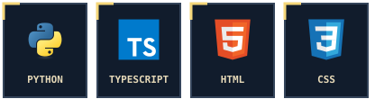
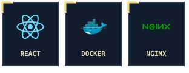

  

<samp>A senior high school student from Taiwan</samp>

  
  &nbsp;
  
  &nbsp;
  

 

<h3 align="center">🧰 The workbench</h3>

  
  

 

  <picture>
    <source media="(prefers-color-scheme: dark)" srcset="https://raw.githubusercontent.com/fearnot221/fearnot221/output/github-contribution-grid-snake-dark.svg">
    <source media="(prefers-color-scheme: light)" srcset="https://raw.githubusercontent.com/fearnot221/fearnot221/output/github-contribution-grid-snake.svg">
    
  </picture>

 

<h3 align="center">💾 Activity log</h3>

  
  

